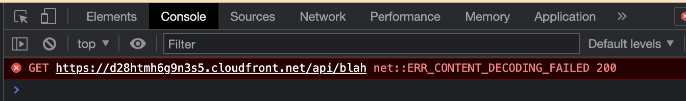

In `next.config.js` we have a rewrite rule like this

```javascript
{
  source: '/api/:path*',
  destination: `https://github.com/:path*`,
}
```

Navigating to `/api/*` will give us `net::ERR_CONTENT_DECODING_FAILED 200`
